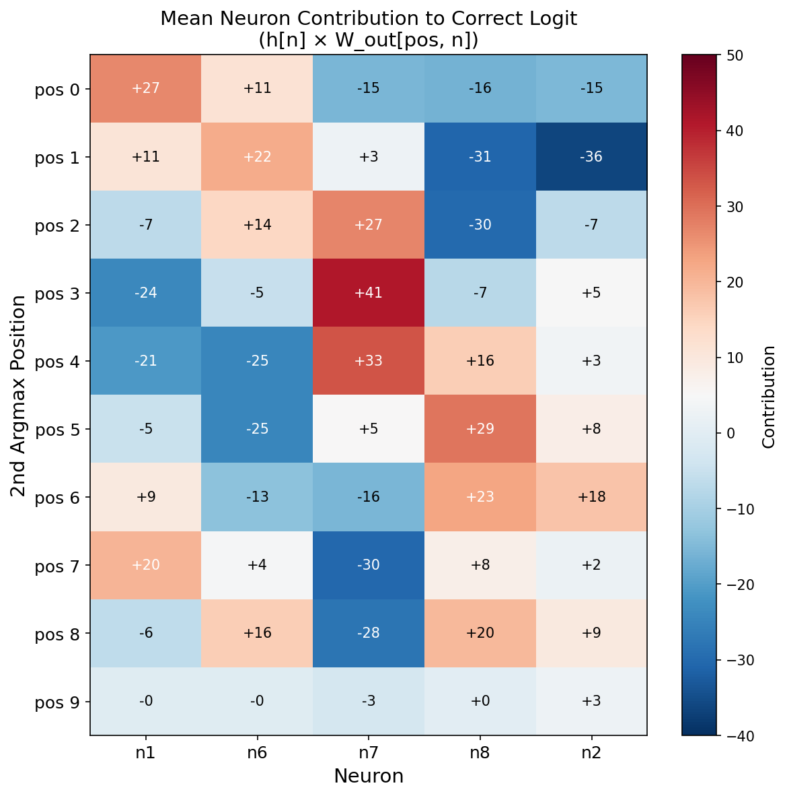
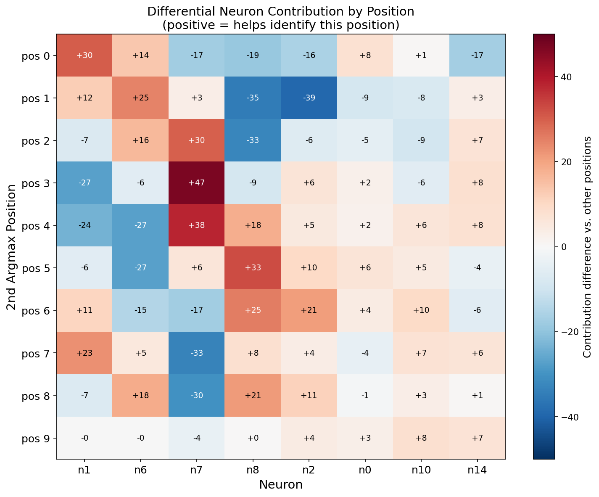
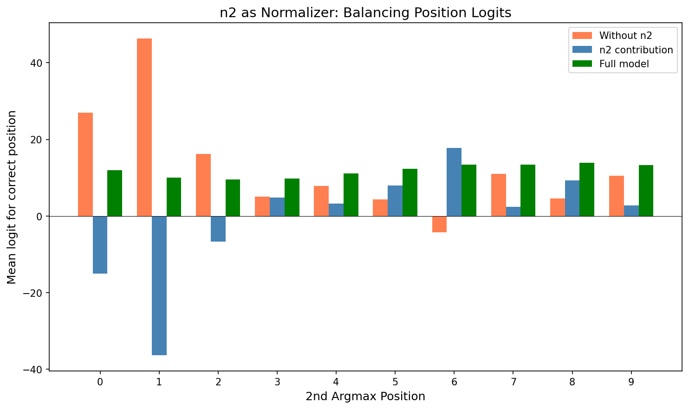
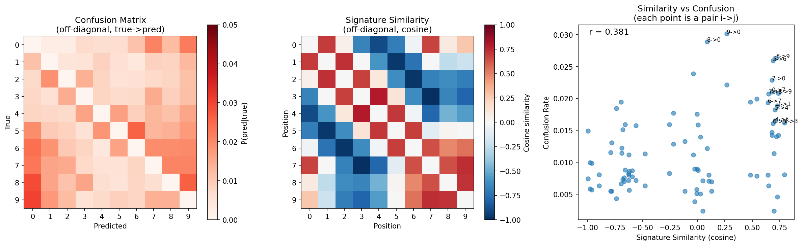

# 05: Position Encoding Mechanism

## Overview

How does the model track the position of the 2nd argmax? This document reveals that position is encoded through a **distributed code** across multiple neurons, with n2 playing a critical role as a normalizer.

## Key Finding

Position is NOT explicitly stored. Instead, it emerges from:
1. The **values** of comparator neurons (n1, n6, n7, n8) at t=9
2. The **normalization** provided by n2 (the analog max tracker)

Neither component works alone - the combination is essential.

## Ablation Study

| Neurons Used | Accuracy |
|-------------|----------|
| Full model (all 16) | 89% |
| Comparators only (n1,n6,n7,n8) | 12% |
| n2 only | 10% |
| All except n2 | 13% |
| Comparators + n2 | 11% |

**Surprising result**: Removing n2 drops accuracy from 89% to 13%, even though n2 has the **lowest** output weight importance of all neurons!

## The Distributed Position Code

Each position has a unique "signature" across the four comparator neurons plus n2:



This heatmap shows the mean contribution (h[n] × W_out[pos, n]) from each key neuron to the correct position's logit. Clear patterns emerge:

- **n7**: Dominates middle positions (2,3,4) with +27 to +41
- **n8**: Dominates late-middle positions (4,5,6,8) with +16 to +29
- **n1**: Handles early (0) and position 7 with +20 to +27
- **n6**: Complements n1, strong for positions 1,2,8
- **n2**: Strongly negative for positions 0,1 (-15, -36), positive for position 6 (+18)

Position 9 is distinctive: all comparators contribute ~0 (they clipped at t=9), only n2 provides signal.

The differential view shows how each neuron helps vs hurts each position:



The heatmap shows differential contributions: how much each neuron helps (positive/red) or hurts (negative/blue) each position relative to other positions.

### Position Signatures

| Pos | n1 | n6 | n7 | n8 | Pattern |
|-----|----|----|----|----|---------|
| 0 | ++ | + | -- | -- | early |
| 1 | + | ++ | . | -- | early |
| 2 | - | ++ | ++ | -- | early-middle |
| 3 | -- | - | ++ | - | middle |
| 4 | -- | -- | ++ | ++ | middle |
| 5 | - | -- | + | ++ | late-middle |
| 6 | + | - | -- | ++ | late-middle |
| 7 | ++ | + | -- | + | late |
| 8 | - | ++ | -- | ++ | late |
| 9 | . | . | - | . | (weak) |

Each position has a unique 4-neuron signature, similar to a distributed binary code but with analog values.


## n2 as Normalizer

Without n2, the logits are heavily biased:

| Position | Without n2 | n2 contribution | Full logit |
|----------|------------|-----------------|------------|
| 0 | +27 | -15 | +12 |
| 1 | +46 | -36 | +10 |
| 2 | +16 | -7 | +10 |
| 3 | +5 | +5 | +10 |
| 4 | +8 | +3 | +11 |
| 5 | +4 | +8 | +12 |
| 6 | -5 | +18 | +13 |
| 7 | +11 | +3 | +14 |
| 8 | +5 | +9 | +14 |
| 9 | +10 | +3 | +13 |



**Key insight**: n2 has small output weights but large activation (~16), producing significant contributions. Its weights are tuned to:
- **Suppress** early positions (0, 1) which are overpredicted
- **Boost** middle-late positions (5, 6, 8) which are underpredicted

After n2's contribution, all correct logits fall in a balanced range (~10-14).

## Why n2 is Critical

n2 tracks the running maximum (r=0.83 correlation). Its output weights encode position-dependent corrections that compensate for biases in the other neurons.

| Property | Value |
|----------|-------|
| W_ih[2] | +0.015 (near zero - pure integrator) |
| Mean h[2] | ~16 (large activation) |
| W_out importance rank | 16th (lowest!) |
| Accuracy impact | 89% → 13% when removed |

The paradox: n2 has the lowest output weight magnitude but removing it destroys accuracy.

## How Position is Decoded

1. **Comparators encode recency**: When n7 clips at time t, its value at t=9 depends on how long ago it clipped. Recent clips → low values.

2. **Different neurons prefer different positions**: n1 has positive weights for early positions (0,1,7), n7 has positive weights for middle positions (2,3,4), etc.

3. **n2 normalizes**: Without n2, the comparator signals produce heavily biased logits. n2's contribution rebalances them.

4. **The combination decodes position**: The output logit for position p is:
   ```
   logit[p] = Σ_n h[n] * W_out[p, n]
   ```
   With all neurons contributing, each position gets a unique score.

## Position 9: A Special Case

When the 2nd argmax is at t=9:
- All comparators clip at the final step
- h[1,6,7,8] ≈ 0
- Only n2 (and other analog neurons) provide signal
- The near-zero comparator pattern uniquely identifies position 9

Accuracy at position 9: 88% (not much worse than average)

## Implications

1. **Distributed codes are fragile**: No single neuron encodes position, but removing the "unimportant" n2 destroys the code.

2. **Importance ≠ weight magnitude**: n2 has small weights but large activation, making it critical despite low weight-based importance.

3. **Normalization is implicit**: The model learned to use n2's max-tracking signal for bias correction, not just for comparison.

4. **Recency encoding**: Position information comes from the decay/rebuild dynamics of neurons after clipping, not from explicit position counters.

## Confusion Analysis

Do positions with similar signatures get confused more often?



### Correlation

The correlation between signature similarity and confusion rate is **r = 0.38** - moderate but not strong. This suggests signatures explain some but not all of the confusion patterns.

### Key Confusion Patterns

| True | Pred | Rate | Signature Similarity |
|------|------|------|---------------------|
| 9 | 0 | 3.5% | 0.26 |
| 8 | 0 | 2.8% | 0.09 |
| 8 | 9 | 2.8% | 0.72 |
| 7 | 0 | 2.4% | 0.68 |
| 0 | 7 | 2.1% | 0.68 |

### Why Position 0 is Over-Predicted

Position 0 is the most common false prediction, especially for late positions (6,7,8,9). This happens because:

1. **Output weights for position 0**: W_out[0,:] has positive weights for n1 (+6.1) and n6 (+2.5), but negative for n7 (-2.8) and n8 (-3.6)

2. **Late 2nd argmax → all comparators low**: When 2nd argmax is at a late position, all comparators clip near the end, leaving h[1,6,7,8] with low values at t=9

3. **Low comparators favor position 0**: With all comparators low:
   - Positions with positive comparator weights (like 0) lose less
   - Positions with negative comparator weights (like 0 for n7, n8) actually gain

This creates a "default to 0" behavior when the signal is weak.

### Similar Signature Pairs

Positions 0 and 7 have notably similar signatures:
```
Position 0: n1=+30, n6=+13, n7=-17, n8=-19
Position 7: n1=+23, n6=+5,  n7=-33, n8=+8
```
Both have n1 positive and n7 negative. Their mutual confusion rate is ~2%.

Opposite signatures (like 3 vs 7) have low confusion:
```
Position 3: n1=-27, n6=-5, n7=+47, n8=-8
Position 7: n1=+23, n6=+5, n7=-33, n8=+8
```
Confusion rate: ~1%.

## Scripts

See `src/position_encoding_analysis.py` for the experimental code and figure generation.
