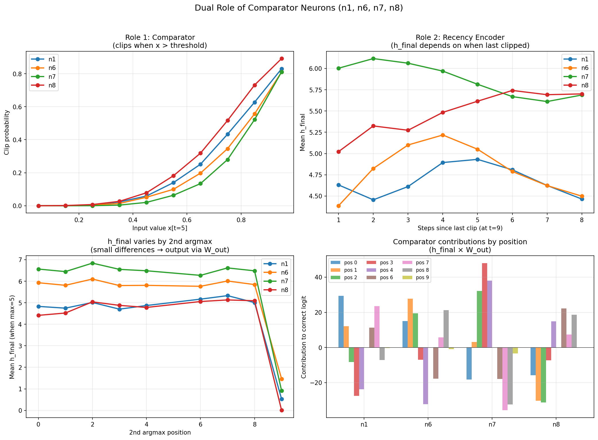

# 07: Dual Role Mechanism of Comparator Neurons

## Overview

The comparator neurons (n1, n6, n7, n8) serve **two simultaneous roles** through a single unified mechanism:

1. **Role 1: Comparators** - Detect when input exceeds threshold (≈ running max)
2. **Role 2: Position Encoders** - Their final values encode the 2nd argmax position

The key insight: **clipping + rebuild dynamics** create both functions without needing separate mechanisms.

## The Mechanism

### Clipping Phase

When a large value x[t] arrives:
- Pre-activation = W_hh @ h_prev + W_ih * x[t]
- With W_ih ≈ -11, large x makes pre-activation negative
- ReLU clips: h[n,t] → 0

### Rebuild Phase

After clipping, the neuron rebuilds over subsequent timesteps:
```
h[n,t+1] = ReLU(W_hh[n,:] @ h[t] + W_ih[n] * x[t+1])
```

The **value at t=9** depends on:
- **Steps since last clip**: More time → more rebuild → larger value
- **Self-recurrence W_hh[n,n]**: Higher → slower rebuild
- **Cross-neuron connections**: Other neurons feed into rebuild

### Recency Encoding

| Steps since clip | n1 mean h | n6 mean h | n7 mean h | n8 mean h |
|-----------------|-----------|-----------|-----------|-----------|
| 1 | 4.64 | 4.40 | 5.96 | 5.04 |
| 2 | 4.40 | 4.71 | 6.05 | 5.29 |
| 3 | 4.52 | 5.02 | 6.04 | 5.20 |
| 4 | 4.78 | 5.18 | 5.96 | 5.50 |
| 5 | 4.92 | 4.94 | 5.73 | 5.49 |
| 6 | 4.79 | 4.79 | 5.59 | 5.67 |
| 7 | 4.57 | 4.68 | 5.69 | 5.75 |
| 8 | 4.46 | 4.53 | 5.60 | 5.74 |

**Correlation with steps_since_clip:**
- n1: r = 0.31
- n6: r = 0.32
- n7: r = 0.24
- n8: r = 0.37

The correlations are moderate but consistent - h_final does encode recency information.

## Different Rebuild Rates

| Neuron | Self-recurrence W_hh[n,n] | Rebuild behavior |
|--------|---------------------------|------------------|
| n1 | +0.41 | Moderate rebuild |
| n6 | +0.36 | Moderate rebuild |
| n7 | +0.08 | Fast rebuild (nearly memoryless) |
| n8 | +0.62 | Slow rebuild (strong memory) |

The **different rebuild rates** create distinguishable patterns across the four neurons, enabling position discrimination.

## Clip Timing vs Argmax

How well does clipping align with argmax/2nd_argmax?

| Neuron | Last clip = argmax | 2nd-to-last clip = 2nd_argmax |
|--------|-------------------|------------------------------|
| n7 | 87% | 44% |
| n6 | 59% | 28% |
| n1 | 58% | 32% |
| n8 | 49% | 27% |

**n7 is the most reliable comparator** - its last clip position matches argmax 87% of the time. This makes sense given its highest |W_ih| = -13.17.

The 2nd-to-last clip matching 2nd_argmax is lower (~28-44%) because:
- Not every large value causes clipping
- Some sequences have multiple values close to max
- The threshold adapts, so early "large" values may not trigger clips

## h_final by 2nd_argmax Position

When max is fixed at position 5, how do comparator values vary by 2nd_argmax?

| 2nd_argmax | h1 | h6 | h7 | h8 |
|------------|-----|-----|-----|-----|
| 0 | 4.87 | 5.98 | 6.62 | 4.42 |
| 1 | 4.79 | 5.85 | 6.51 | 4.61 |
| 2 | 4.92 | 6.01 | 6.73 | 4.92 |
| 3 | 4.81 | 5.90 | 6.66 | 4.97 |
| 4 | 4.89 | 5.84 | 6.52 | 4.77 |
| 6 | 5.15 | 5.75 | 6.25 | 5.04 |
| 7 | 5.22 | 5.90 | 6.50 | 5.03 |
| 8 | 4.98 | 5.77 | 6.43 | 5.15 |
| 9 | 0.48 | 1.41 | 0.84 | 0.00 |

**Key observations:**
- Position 9 is dramatically different (all comparators clip at final step)
- Early positions (0,1,2) have longer to rebuild after 2nd_argmax clip → larger values
- Late positions (6,7,8) have less time to rebuild → smaller values
- The differences are small (±0.5) but consistent

## How Small Differences Become Decisions

The small differences in h_final (e.g., h1 ranging 4.79-5.22) become decisive through W_out:

```
logit[pos] = Σ_n h_final[n] × W_out[pos, n]
```

Each position has a unique W_out signature (see doc 05). The h_final variations, though small, systematically favor the correct position because:

1. When 2nd_argmax = p, comparators clipped at position p
2. This affects their rebuild trajectory
3. The resulting h_final has slightly higher values for neurons with positive W_out[p, n]
4. And slightly lower values for neurons with negative W_out[p, n]
5. This tilts the logits toward the correct position

## Visualization



The four panels show:
1. **Role 1**: Clip probability vs input value (comparator behavior)
2. **Role 2**: h_final vs steps since clip (recency encoding)
3. **h_final by 2nd_argmax**: Small but systematic differences
4. **Contributions to output**: How h_final × W_out creates position logits

## Circuit Diagram

```
INPUT x[t]
    |
    v
+------------------+
| COMPARATORS      |
| n1, n6, n7, n8   |
|                  |
| IF x[t] > thresh:|
|   h[n] → 0       |
| ELSE:            |
|   h[n] rebuilds  |
+------------------+
    |
    | (clipping encodes WHEN large values occur)
    | (rebuild encodes TIME SINCE clip)
    v
+------------------+
| At t=9:          |
| h_final[n]       |
| encodes recency  |
+------------------+
    |
    v
+------------------+
| W_out[pos, n]    |
| Different for    |
| each position    |
+------------------+
    |
    v
+------------------+
| logit[pos] =     |
| Σ h × W_out      |
| → argmax gives   |
| predicted pos    |
+------------------+
```

## Why This Works

The dual-role mechanism is elegant because:

1. **Single mechanism, two functions**: Clipping both detects large values AND encodes position through rebuild dynamics

2. **No explicit position counter**: Position emerges from temporal dynamics, not stored explicitly

3. **Analog encoding in "binary" neurons**: Despite acting like comparators, the rebuild values are analog and carry continuous information

4. **Redundancy through diversity**: Four comparators with different rebuild rates create a distributed code that's robust to noise

## Comparison to Traditional Approaches

| Approach | How position is encoded |
|----------|------------------------|
| One-hot | Explicit position neurons (10 needed) |
| Positional encoding | Added to input (transformer-style) |
| Counter | Explicit increment each step |
| **This model** | Implicit through rebuild dynamics |

The model achieves position encoding with 0 dedicated neurons - it emerges from the dynamics of neurons that serve another purpose (comparison).

## Implications

1. **Efficiency**: Dual-purpose neurons reduce parameter count
2. **Emergence**: Complex functions can emerge from simple dynamics
3. **Interpretability challenge**: The same neuron contributes to multiple computations
4. **Generalization**: This pattern may appear in other small RNNs

## Scripts

See `src/dual_role_analysis.py` for the experimental code and figure generation.
