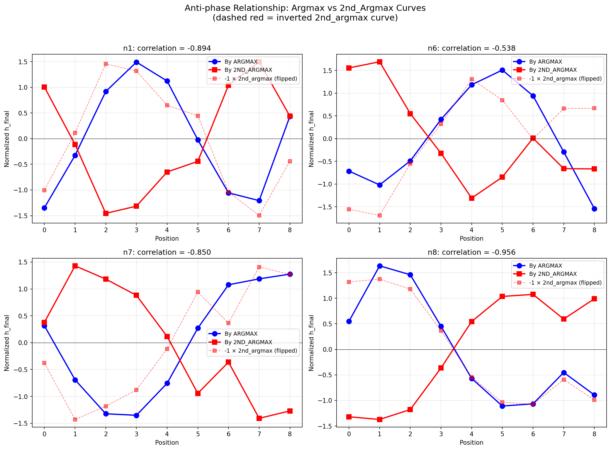

# 08: Interference-Based Position Encoding

## Overview

The 2nd argmax model encodes position information through a remarkable mechanism analogous to wave interference. The four comparator neurons (n1, n6, n7, n8) act as Fourier-like components at different frequencies, and the argmax and 2nd_argmax positions create **anti-phase signals** that interfere to encode their relative timing.

## The Key Discovery

When we plot h_final as a function of argmax position vs 2nd_argmax position (excluding position 9), the curves are **nearly mirror images**:

| Neuron | Anti-phase Correlation |
|--------|----------------------|
| n8 | -0.970 |
| n1 | -0.895 |
| n7 | -0.850 |
| n6 | -0.538 |



The dashed red lines show the **inverted** 2nd_argmax curves - they align remarkably well with the argmax curves (blue), confirming the anti-phase relationship.

## The Interference Mechanism

### Clipping as Impulse

Each clipping event acts like a Dirac delta impulse into the system:
1. When x[t] exceeds the adaptive threshold, comparators clip (h → 0)
2. After clipping, neurons rebuild according to their recurrence dynamics
3. The value at t=9 encodes "time since clipping"

### Fourier-like Responses

The four comparators have different self-recurrence values, creating different "frequencies":

| Neuron | Self-recurrence | Effective Frequency | Character |
|--------|-----------------|---------------------|-----------|
| n8 | 0.62 | π/2 (slowest) | Quarter wave |
| n6 | 0.36 | π | Half wave |
| n1 | 0.41 | 2π (fastest) | Full wave |
| n7 | 0.08 | 3π/2 | Three-quarter wave |

### Two Impulses, Opposite Phase

When the sequence contains both argmax and 2nd_argmax:

```
h_final[n] ≈ A·f_n(t_argmax) + B·f_n(t_2nd_argmax)
```

Where:
- `f_n()` is the Fourier-like response function for neuron n
- `A` and `B` encode the response amplitudes
- Critically: the responses have **opposite phase**

This means:
- Argmax at early position → high h_final component
- 2nd_argmax at early position → **low** h_final component (inverted)

### Destructive Interference Encodes Difference

The anti-phase encoding creates **destructive interference**:

```
h_final ∝ f(pos_argmax) - f(pos_2nd_argmax)
```

When argmax and 2nd_argmax are at similar positions, the signals **partially cancel**. When they're far apart, one dominates. The **residual pattern** after interference encodes the difference.

This is analogous to:
- **Interferometry**: Path length differences create fringe patterns
- **I/Q demodulation**: Phase differences encode timing
- **Differential signaling**: Common-mode rejection reveals the signal

## Two Operating Regimes

The model operates differently depending on temporal order:

### Regime 1: 2nd_argmax BEFORE argmax (50% of cases)

- Both positions trigger clipping events
- Two impulses enter the system
- Classic interference: both signals present
- Accuracy: 89.1%

Clipping rates at 2nd_argmax position: 97-98% for all comparators

### Regime 2: 2nd_argmax AFTER argmax (50% of cases)

- Argmax clips and raises threshold high
- 2nd_argmax often **does not clip** (it's smaller than max)
- Only one impulse enters the system
- **Absence of second impulse is the signal**
- Accuracy: 89.2% (essentially identical!)

Clipping rates at 2nd_argmax position: 0-65% depending on gap

### The Absence Signal

When 2nd_argmax comes after argmax with a large gap:
- n7 clips at 2nd_argmax only 0.3% of the time
- Yet accuracy remains ~92%

The **absence** of a second clipping event is itself informative:
- If argmax is at position 8, only position 9 is after it
- Single impulse pattern uniquely identifies this regime
- The model learns to decode "missing" information

## Threshold Cascade

The four comparators have different W_ih values, creating a **threshold cascade**:

| Neuron | W_ih | Clips at |
|--------|------|----------|
| n1 | -10.56 | Lowest threshold (easiest to clip) |
| n6 | -11.00 | Low-medium threshold |
| n8 | -12.31 | Medium-high threshold |
| n7 | -13.17 | Highest threshold (hardest to clip) |

When a value is between thresholds:
- Some comparators clip, others don't
- The **pattern of partial clipping** encodes amplitude information
- This allows discrimination even when only one impulse occurs

Partial clipping patterns by 2nd_max value:
```
Pattern (n1,n6,n7,n8) | Mean 2nd_max value
0000                  | 0.738 (lowest)
1000                  | 0.752
0001                  | 0.774
1111                  | 0.819 (highest)
```

## Envelope-Phase Decomposition

The system can be viewed as computing envelope and phase:

**Envelope** (total magnitude across comparators):
- Correlates with max value (r ≈ 0.13)
- Provides normalization context

**Phase** (relative differences between comparators):
- diff(h6 - h8) correlates with argmax position (r = 0.46)
- diff(h1 - h7) correlates with 2nd_argmax position (r = 0.20)

This is analogous to **Hilbert transform** analysis:
- Instantaneous amplitude = envelope
- Instantaneous phase = timing information

## The Complete Picture

```
INPUT SEQUENCE
     |
     v
[Clipping Events]
  - Argmax clips → impulse at t_max
  - 2nd_argmax clips → impulse at t_2nd (if before argmax)
  - Or: absence of 2nd impulse (if after argmax)
     |
     v
[Fourier-like Decomposition]
  - n8 (π/2): slowest, coarse timing
  - n6 (π): medium frequency
  - n1 (2π): fastest, fine timing
  - n7 (3π/2): medium-fast
     |
     v
[Interference]
  - Argmax signal: f(t_max)
  - 2nd_argmax signal: -f(t_2nd) [OPPOSITE PHASE]
  - h_final ≈ f(t_max) - f(t_2nd)
     |
     v
[Matched Filter Decoding]
  - W_out[j,:] = template for 2nd_argmax = j
  - logit[j] = h_final · W_out[j,:]
  - argmax(logits) = predicted 2nd_argmax
```

## Why This Works

1. **Robustness**: Encoding the difference rather than absolute positions provides common-mode rejection

2. **Efficiency**: 4 neurons encode two positions through their relationship, not independently

3. **Multi-resolution**: Different frequencies provide coarse-to-fine timing information

4. **Graceful degradation**: When only one impulse occurs, partial clipping and absence patterns still provide information

## Analogy to Physical Systems

| Physical System | This Model |
|----------------|------------|
| Two-slit interference | Two clipping events |
| Fringe pattern | h_final across comparators |
| Path length difference | Position difference |
| Detector array | W_out matched filters |
| Wavelength | Comparator frequency (self-recurrence) |

## Implications for Interpretability

1. **Superposition**: h_final doesn't encode positions independently - it encodes their **interference pattern**

2. **Anti-phase is learned**: The opposite-sign relationship emerges from training, not architecture

3. **Absence is information**: What **doesn't** happen (no second clip) is as important as what does

4. **Multi-scale encoding**: Different neurons capture different temporal scales simultaneously

## Scripts

- `src/antiphase_analysis.py` - Anti-phase correlation analysis
- `src/hilbert_analysis.py` - Envelope-phase decomposition
- `src/clipping_order_analysis.py` - Two-regime analysis
- `src/fourier_encoding_analysis.py` - Frequency analysis
- `src/impulse_response_analysis.py` - Impulse response visualization

## Summary

The 2nd argmax model solves position encoding through **wave interference**:

1. Comparator neurons act as Fourier components at different frequencies
2. Clipping events send impulses into these components
3. Argmax and 2nd_argmax create **anti-phase signals**
4. Their **destructive interference** encodes the position difference
5. W_out acts as a matched filter bank to decode the interference pattern

This is a beautiful example of how neural networks can discover elegant computational strategies that mirror physical phenomena like wave interference and spectral analysis.
