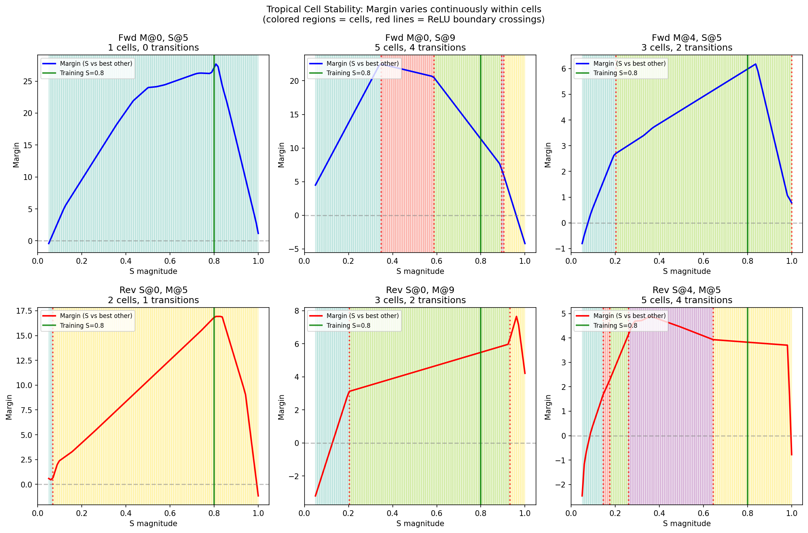
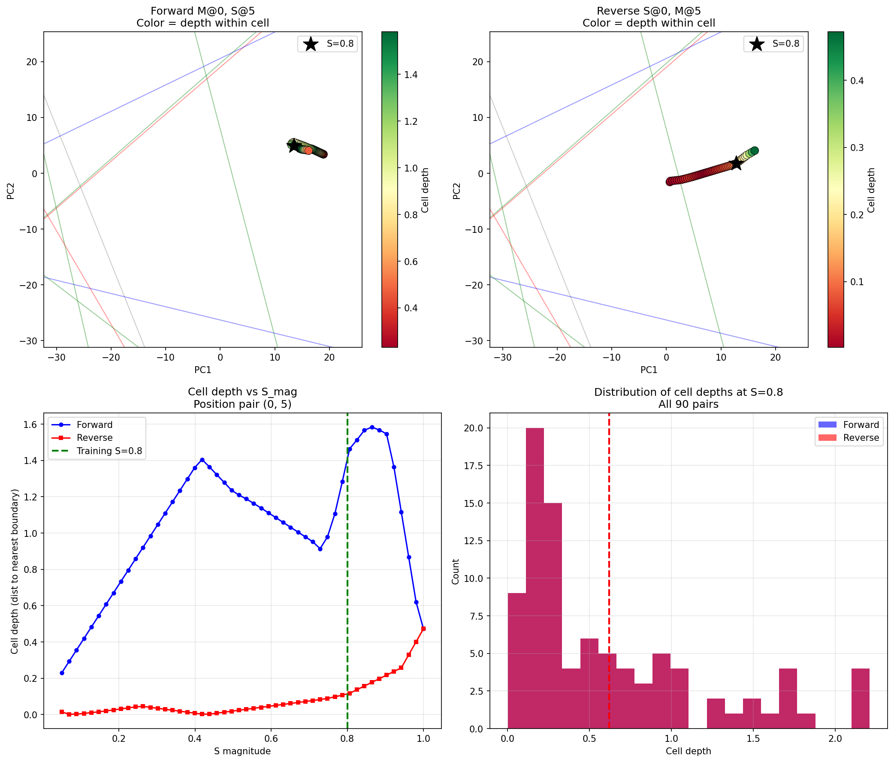

# 35: Tropical Geometry Lens on the Circuit

## Overview

Tropical geometry provides a mathematical framework for understanding ReLU networks. Each ReLU is a tropical operation: `relu(x) = max(x, 0) = x ⊕ 0` in the max-plus semiring. The 16 neurons × 10 timesteps = 160 ReLU activations define a **tropical hyperplane arrangement**. Each input selects a **tropical cell** — a region where all activation patterns are fixed and the input→output map is affine.

This document applies tropical analysis to reveal the circuit's structure from a new angle.

## The Tropical Eigenvector

The tropical eigenvalue problem for W_hh finds which neurons are "tropically dominant" — sustained by recurrence vs. transient.

**Tropical eigenvalue**: λ = 1.235 (maximum cycle mean = asymptotic growth rate)

**Tropical eigenvector ranking** (higher = more sustained by recurrence):

| Rank | Neuron | Category | Trop_v | Active% | ||W_out|| |
|------|--------|----------|--------|---------|----------|
| 1 | n15 | Bridge | -241.27 | 81% | 4.4 |
| 2 | n10 | Wave | -241.27 | 86% | 6.3 |
| 3 | n2 | Other | -241.30 | 100% | 2.8 |
| 4 | n11 | Wave | -241.31 | 91% | 5.0 |
| 5 | n3 | Bridge | -241.39 | 78% | 3.0 |
| ... | ... | ... | ... | ... | ... |
| 14 | n14 | Wave | -242.01 | 97% | 6.0 |
| 15 | n9 | Other | -242.21 | 11% | 4.0 |
| 16 | n4 | Other | -242.21 | 14% | 5.2 |

**Key finding**: Tropical dominance predicts activation frequency (r=0.64) but is **anti-correlated** with output influence. The circuit has a division of labor:

- **Tropically dominant** (bridges, waves): Sustain the dynamics
- **Tropically weak but high output** (comparators): Do the readout

## The n4 Paradox Resolved

n4 has the **lowest** tropical eigenvector but appears in **all top cycles**. This paradox resolves when we examine its connectivity:

| Property | n4's Value | Interpretation |
|----------|-----------|----------------|
| W_ih | **+10.16** | Highest input sensitivity (#1/16) |
| Self-loop | **-0.99** | Kills itself immediately |
| Pump ratio | **50:1** | Massive outflow, minimal inflow |
| Active at t=10 | **14%** | Rarely survives to readout |

**n4 is the input transducer**: It fires immediately on input, pumps energy into the sustained neurons, then dies. It's the *trigger* of the tropical cycles, not a node *sustained by* them.

```
INPUT (magnitude)
    ↓ W_ih = +10.16
   n4 (fires once)
    ↓ pumps +1.7 to n10, n11, n2
   [waves, bridges sustain]
    ↓
   n4 dies (self-inhibition -0.99)
```

## The Critical Cascade (Not a Cycle)

The "maximum mean cycle" from tropical analysis is **n4 → n11 → n15 → n4** with mean 0.994. But examining the edges reveals it's not a true cycle:

```
n4  → n11:  +1.71  (STRONG - transducer pumps wave)
n11 → n15:  +1.28  (STRONG - wave feeds bridge)
n15 → n4:   -0.01  (ESSENTIALLY ZERO)
```

This is a **feed-forward cascade**, not an oscillator:

```
INPUT ──→ n4 (transducer, fires once)
           │
           ├──→ n11 (wave) ←──┐
           │      │           │
           │      ↓ +1.28     │ mutual
           │    n15 (bridge) ─┘ sustaining
           │
           ├──→ n10 (wave)
           │
           └──→ n2 (latch, 0.97 self-loop)
```

The waves and bridges form a **sustaining subnetwork** that n4 pumps but doesn't participate in.

## Revised Neuron Classification

### Input Layer

| Neuron | W_ih | Role |
|--------|------|------|
| **n4** | +10.16 | **Input transducer** - fires on input, pumps network, dies |
| n12 | +0.30 | Weak positive input sensitivity |
| n11 | +0.15 | Weak positive |
| n0, n10 | ~+0.06 | Near-zero (input-blind) |

### Sustained Dynamics Layer

| Neurons | Tropical Rank | Role |
|---------|---------------|------|
| **n11, n10, n12, n14, n0** (waves) | High | Carry recurrent cascade, oscillatory dynamics |
| **n15, n3, n13, n5** (bridges) | Highest | Couple waves ↔ comps, sustain longest |
| **n2** (latch) | #3 | Self-sustaining (0.97), memory of first impulse |

### Readout Layer

| Neurons | W_ih | ||W_out|| | Role |
|---------|------|----------|------|
| **n7** | -13.17 | 14.0 | Primary comparator |
| **n8** | -12.31 | 13.1 | Primary comparator |
| **n1** | -10.57 | 11.5 | Secondary comparator |
| **n6** | -11.00 | 11.3 | Secondary comparator |

The comparators are **inhibited by input** (large negative W_ih). They don't see magnitude directly — they see the *effect* of input on the sustained dynamics.

### Auxiliary

| Neuron | Role |
|--------|------|
| **n9** | Secondary relay, critical for small-gap reversed (fires only on reversed) |

## The Complete Circuit (Tropical View)

```
┌─────────────────────────────────────────────────────────────────────┐
│                    TROPICAL CIRCUIT ARCHITECTURE                     │
├─────────────────────────────────────────────────────────────────────┤
│                                                                      │
│  INPUT ──────────────────────────────────────────────────────────┐  │
│    │                                                              │  │
│    │ W_ih = +10.16                              W_ih = -10 to -13 │  │
│    ↓                                                              ↓  │
│   n4 (transducer)                                    COMPARATORS    │
│    │ fires once, dies                               n1, n6, n7, n8  │
│    │                                                (inhibited by   │
│    │ pumps +1.7                                      input, high    │
│    ↓                                                 W_out)         │
│  ┌─────────────────────────┐                              ↑         │
│  │   SUSTAINED DYNAMICS    │                              │         │
│  │                         │                              │         │
│  │  n11 ←→ n15 (critical)  │──────────────────────────────┘         │
│  │   ↕       ↕             │     (via bridges)                      │
│  │  n10    n3, n13         │                                        │
│  │   ↕                     │                                        │
│  │  n12, n14, n0 (waves)   │                                        │
│  │                         │                                        │
│  │  n2 (latch, 0.97 self)  │──→ gates n4 on 2nd impulse             │
│  │                         │                                        │
│  └─────────────────────────┘                                        │
│                                                                      │
│  Tropically dominant                    Tropically weak but          │
│  (sustain dynamics)                     high readout influence       │
│                                                                      │
├─────────────────────────────────────────────────────────────────────┤
│                                                                      │
│  Energy flow:  INPUT → n4 → [waves/bridges sustain] → comparators   │
│                                                                      │
│  Information:  Position encoded in WHICH tropical cell trajectory    │
│                lands in (which neurons active at t=10)               │
│                                                                      │
└─────────────────────────────────────────────────────────────────────┘
```

## ReLU Boundaries in PCA Space

Each ReLU boundary (neuron i's pre-activation = 0) is a hyperplane in 16D hidden state space. Projected to PCA, these become **lines** that partition the state space into tropical cells.

The animations (`tropical_animation_pos_*.mp4`) show trajectories crossing these boundaries:
- **Solid lines**: Neurons active at t=10
- **Dashed lines**: Neurons dead at t=10
- **Colors**: Red=comp, Blue=wave, Green=bridge, Gray=other

Forward and reverse trajectories cross **different boundaries** at different times, ending in **different tropical cells** — this is the geometric realization of the offset mechanism.

## Connection to Offset Mechanism

The offset `h_fwd - h_rev` can be understood tropically:

1. **Different gating**: Fwd and rev cross different ReLU boundaries
2. **Different cells**: They land in different tropical cells at t=10
3. **Antisymmetric readout**: W_out is structured so that the cell difference always favors s_pos

The separable structure `offset ≈ f(m_pos) + g(s_pos)` reflects that:
- f encodes which boundaries the M-first trajectory crossed
- g encodes which boundaries the S-first trajectory crossed

## Quantitative Summary

| Metric | Value | Interpretation |
|--------|-------|----------------|
| Tropical eigenvalue λ | 1.235 | Max cycle mean (growth rate) |
| Critical cascade | n4→n11→n15 | Input-to-dynamics pathway |
| n4 pump ratio | 50:1 | One-way valve (trigger) |
| n2 self-loop | 0.97 | Memory latch |
| Corr(trop_v, active%) | 0.64 | Dominance predicts activation |
| Corr(trop_v, ||W_out||) | -0.17 | Anti-correlated (division of labor) |

## Implications

1. **The circuit is near capacity**: All 16 neurons play distinct roles. The tropical analysis confirms there's no redundancy — this is a "lucky seed" that found an efficient solution.

2. **Division of labor is fundamental**: Sustaining dynamics (waves/bridges) vs. readout (comparators) are handled by different neuron groups with opposite tropical properties.

3. **n4 is architecturally unique**: Highest input sensitivity, self-killing, massive pump ratio. It's the critical interface between input and dynamics.

4. **The "cycle" is really a cascade**: Energy flows INPUT → n4 → sustained network → comparators. The tropical "cycle" captures the backbone of this flow.

5. **ReLU boundaries are the mechanism**: The offset between fwd/rev is fundamentally about crossing different hyperplanes, landing in different affine regions.

## Related Documents

- [27: Mechanistic Reference](27_mechanistic_reference.md) — Complete circuit documentation
- [29: Tropical Geometry Analysis](29_tropical_geometry.md) — Initial tropical analysis
- [33: Offset Discrimination Mechanism](33_offset_discrimination_mechanism.md) — The offset structure
- [34: Fwd/Rev Mechanism Explained](34_fwd_rev_mechanism_explained.md) — "First to fire, first to wire"

## Cell Stability: Operating in a Single Affine Regime

A key finding: the network is tuned to keep the final hidden state **within a single tropical cell** across most of the operating range.

### Statistics

| Metric | Value |
|--------|-------|
| Pairs with stable cell in S_mag ∈ [0.75, 0.85] | **83%** |
| Mean dominant cell coverage (% of S_mag range) | **77%** |
| Prediction changes at boundary crossings | **12%** |
| Prediction changes within same cell | **88%** |

### Implications

1. **Affine discrimination**: Within a cell, `h_final` is an affine function of S_mag, and `W_out @ h` is linear. The discrimination is a simple linear threshold.

2. **Boundary avoidance**: The network avoids crossing ReLU boundaries during normal operation. Only ~2% of S_mag transitions cross a boundary.

3. **Training point is central**: S=0.8 typically sits in the middle of a stable cell, not near boundaries.

4. **Robustness**: Operating within a single cell means small perturbations to S_mag don't cause discontinuous jumps in behavior.

The circuit isn't just "using" tropical geometry — it's **tuned to avoid tropical boundaries** and operate in a single affine regime where linear readout is reliable.



### Cell Depth Does NOT Predict Robustness

We can measure "cell depth" — the distance from h_final to the nearest ReLU boundary:

```
d_i = |W_hh[i, :] @ h_final| / ||W_hh[i, :]||
depth = min(d_i) over all neurons
```

Surprisingly, **depth does not correlate with margin or robustness**:

| Correlation | r | p |
|-------------|---|---|
| Depth vs Margin | 0.038 | 0.61 |
| Depth vs Correct (at S=0.1) | 0.094 | 0.38 |

Low-depth pairs (near boundaries) actually have slightly *higher* margins than average.

**Interpretation**: What matters for discrimination is `W_out @ h`, not geometric distance to boundaries. The network uses continuous variation within cells effectively, regardless of depth. The cell walls are defined primarily by wave/bridge neurons (n10, n9, n3, n0), while comparators sit deeper inside.



## Visualizations

- `docs/tropical_eigenvector_analysis.png` — Eigenvector vs activation/output
- `docs/tropical_dominance_vs_activation.png` — Division of labor
- `docs/n4_hub_analysis.png` — n4 as transducer
- `docs/tropical_pca_analysis_*.png` — ReLU boundaries with trajectories
- `docs/tropical_animation_pos_*.mp4` — Animated boundary crossings
- `docs/tropical_cell_stability.png` — Margin variation within cells
